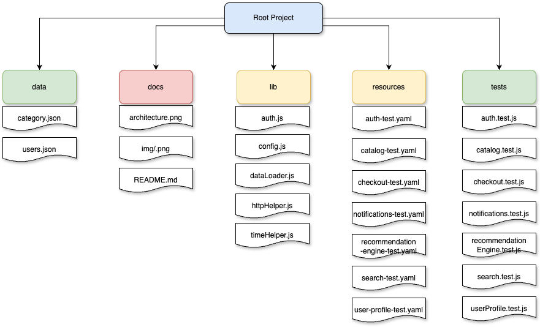

# Grafana k6 Performance Testing Framework

A modular, cloud-ready, and chaos-tolerant performance testing framework built with [K6](https://k6.io) for distributed systems and microservices at scale. This framework is designed to simulate 100k+ concurrent users across multiple regions and services.

---

## 📁 Project Structure




---
## Installation & Setup
> For macOS (Homebrew)
> Install K6 using Homebrew:

```bash

brew install k6
```
> For Linux
> Install K6 using APT:

```bash

sudo apt update && sudo apt install k6
```

For Windows (Chocolatey)
Install K6 using Chocolatey:

```bash

choco install k6
```

[Details installation instruction](https://grafana.com/docs/k6/latest/set-up/install-k6/)

---

## 🚀 How to Run Tests

### 🔧 1. Local Run

> Simulates load from your machine using K6 OSS

```bash

k6 run tests/example.test.js

```
> Custom Env. variable, Virtual Users (VUs), & Duration:

```bash

ENV=prod DURATION=5m VUS=500 k6 run tests/example.test.js

```

### ☁️ 2. K6 Cloud (Distributed Test)
> Run globally distributed tests with real-time dashboards

```bash

k6 cloud tests/example.test.js

```
> Make sure your options include:

```js
export const options = {
  cloud: {
    name: "Load Test Auth Service",
    projectID: YOUR_PROJECT_ID,
    distribution: {
      au_sydney: { loadZone: 'amazon:au:sydney', percent: 50 },
      us_east: { loadZone: 'amazon:us:ashburn', percent: 50 }
    }
  }
};

```

More: [K6 Cloud Documentation](https://grafana.com/docs/grafana-cloud/testing/k6/get-started/)

### ☸️ 3. Kubernetes via k6-operator (for massive distributed testing)

> Install the K6 Operator: macOS (Using Homebrew)
```bash

brew install kubectl
```
```bash

kubectl apply -f https://github.com/grafana/k6-operator/releases/latest/download/k6-operator.yaml

```
> Create a K6 custom resource:

```yml

apiVersion: k6.io/v1alpha1
kind: K6
metadata:
  name: checkout-test
spec:
  parallelism: 10
  script:
    configMap:
      name: checkout-test
      file: checkout.test.js
```

---

## 📈 How to Scale

➕ Add New Service Test
1. Create tests/<service>.test.js

2. Create a scenario in config.js or your test runner

3. Update thresholds in /docs/thresholds.md

4. Tag your metrics: tags: { service: '<name>' }

> 📊 Ramp Load
> 
> Configure VUs and duration in your scenario

```js
export const options = {
  scenarios: {
    spike_checkout: {
      executor: 'ramping-arrival-rate',
      stages: [
        { target: 2000, duration: '30s' },
        { target: 8000, duration: '1m' },
        { target: 1000, duration: '30s' }
      ]
    }
  }
};
```
> Configure thresholds
> 
✅ http_req_duration: Measures overall API response time performance.  
✅ http_req_waiting (TTFB): Tracks the time to first byte, indicating server response delays.  
✅ http_req_receiving: Measures how fast the response data is received after processing.  
✅ http_req_sending: Tracks how quickly the request is sent to the server.  
✅ http_reqs: Ensures the test is generating a sufficient number of API requests.  
✅ vus: Ensures the correct number of virtual users (VUs) are active during the test.  
✅ iterations: Ensures enough test cycles complete successfully to validate system behavior.  
✅ http_req_failed: Helps track API failure rates and ensures reliability.  
✅ checks: Ensures a high percentage of validation checks pass during the test.  
✅ http_req_duration{status:200}: Monitors response time for successful (200 OK) requests.  
✅ http_req_duration{status:400}: Tracks response times for client-side errors (400 series).  
✅ http_req_duration{status:500}: Monitors backend server issues and response times for 500 errors.

---

## 🔄 CI/CD Integration
✅ GitHub Actions (Example)

```yml
jobs:
  performance-test:
    runs-on: ubuntu-latest
    steps:
      - uses: actions/checkout@v3
      - name: Run K6 Cloud Tests
        run: k6 cloud tests/auth.test.js
        env:
          K6_CLOUD_TOKEN: ${{ secrets.K6_CLOUD_TOKEN }}
```

---

## 🔍 Observability: Grafana + InfluxDB
✅ Setup InfluxDB Output

```bash

k6 run --out influxdb=http://localhost:8086/k6 tests/auth.test.js

```
✅ Grafana Dashboard

Use official K6 Grafana Dashboard or build custom dashboards with metrics:

* Requests/sec
* Response Time (p95)
* Error Rate
* VUs & Iterations
* Tags by service / region

📸 Sample Dashboard:


